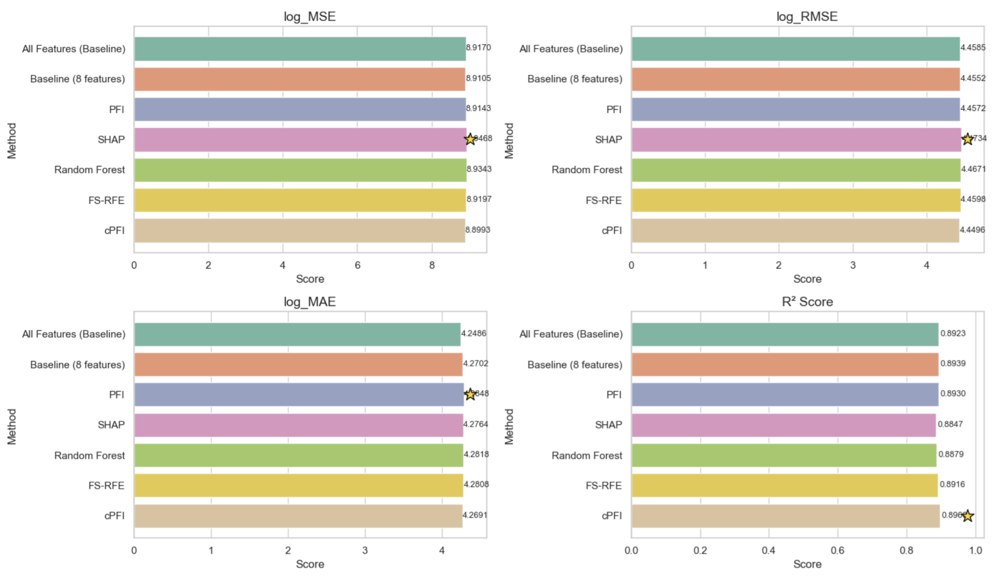
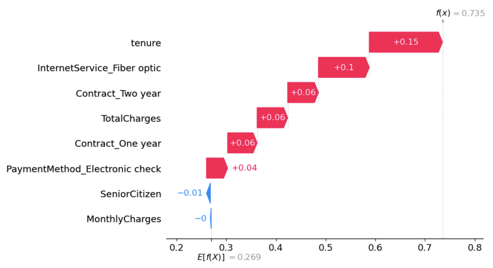

# 🎯 Feature selection and AI explainability

> Used on the Kaggle website, public data sets: feature selection and interpretable machine learning projects for customer churn prediction and house price prediction.  
> ✨ Integrated model insights from SHAP, PFI, RF importance, FK-RFE, and conditional PFI.

---

## 📌 Overview

This project aims to build an interpretable and accurate machine learning pipeline. We do not rely on a single feature selection method, but instead combine multiple methods to ensure robust and interpretable feature importance.

---

## 🧠 Core Concepts

- 🔍**Integrated Feature Importance**: Combines SHAP, PFI, and RF's internal Gini-based feature importance to avoid single model bias.
- 🌀 **FK-RFE**: A hybrid feature selection pipeline combining Kolmogorov filter and recursive elimination via random forest.
- 🌿 **Conditional PFI**: Improves traditional PFI (implemented in RF) by conditioning on local subgroups derived from decision tree paths.
- ⚙️ **Model Benchmarking**: Random Forest (ML), TabNet (DL) — comparing performance and interpretability.

---

## 🏗️ Project Structure

💡 Key Techniques Used

Permutation Feature Importance (PFI)

SHAP (Shapley Additive Explanations)

Random Forest Gini Importance

FK-RFE (Kolmogorov Filter + RF-RFE)

Conditional Permutation Feature Importance (cPFI)

TabNet Deep Feature Learning

---
## 📈 Model Performance

## 🤖🔎 AI Explainability

## 📚 References

Fisher, A., Rudin, C., & Dominici, F. (2019). All models are wrong, but many are useful: Learning a variable's importance by studying an entire class of prediction models simultaneously. Journal of Machine Learning Research, 20(177), 1–81.

Lundberg, S. M., & Lee, S.-I. (2017). A unified approach to interpreting model predictions. Advances in Neural Information Processing Systems, 30.

Arik, S. Ö., & Pfister, T. (2021). TabNet: Attentive interpretable tabular learning. Proceedings of the AAAI Conference on Artificial Intelligence, 35(8), 6679–6687.

Zhang, Y., Zhu, Z., Liu, X., & Yang, W. (2023). A Model‐Free Feature Selection Technique of Feature Screening and Random Forest‐Based Recursive Feature Elimination. Expert Systems, 40(2), e13034.

Pfisterer, F., & Biecek, P. (2024). Model-agnostic feature importance and effects with dependent features: A conditional subgroup approach. Journal of Machine Learning Research, 25(25), 1–45.

## 🙌 Acknowledgements

Special thanks to National Chung Hsing University and the professors who guided this project.

## 📮 Contact

📧 [ccit0915@gmail.com]
🏫 Department of Applied Mathematics, National Chung Hsing University
